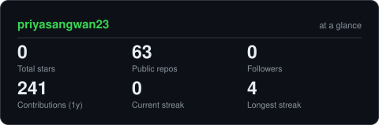

<h1 align="center">Hi 👋, I'm Priya Sangwan</h1>
<h3 align="center">Computer Science Student | Backend Developer | API Enthusiast</h3>

  

  
  
  
  

  

---

## 💫 About Me

🎓 **Computer Science Student** passionate about building robust backend systems

💻 Currently diving deep into **MERN Stack Development**
- Mastering **Node.js & Express** for server-side logic
- Exploring **MongoDB** for efficient data management
- Learning **RESTful API** design principles

🚀 **What I'm up to:**
- Building real-world projects to strengthen my backend skills
- Exploring **System Design** and **Database Optimization**
- Contributing to open source projects

⚡ **Fun fact:** I love solving complex problems and optimizing code for better performance!

---

## 🛠️ Tech Stack

  

---

## 📊 Skill Radar

### Self-Rated Skills

### Language Usage (from my repositories)

---

## 🚀 Featured Projects

---

## 📊 GitHub Stats

  
  

---

## 📈 Contribution Graph

---

## 🐍 Contribution Snake

---

## 🏆 GitHub Trophies

  

---

## 📫 Let's Connect!

  
  
  
  

---

  
  
  <h3>⭐️ From Priya Sangwan ⭐️</h3>
  
  

